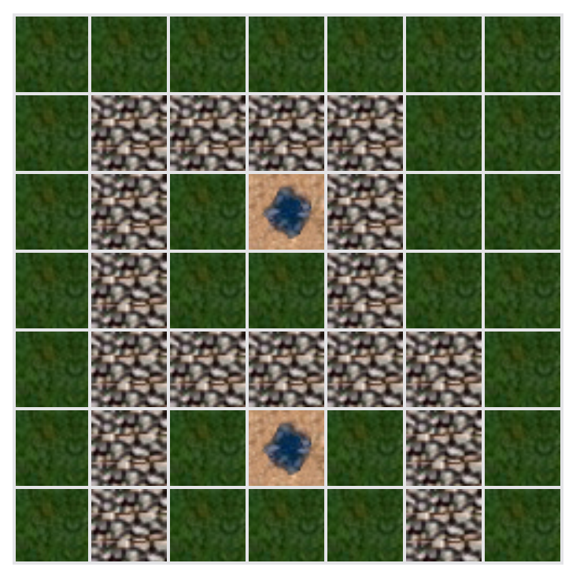
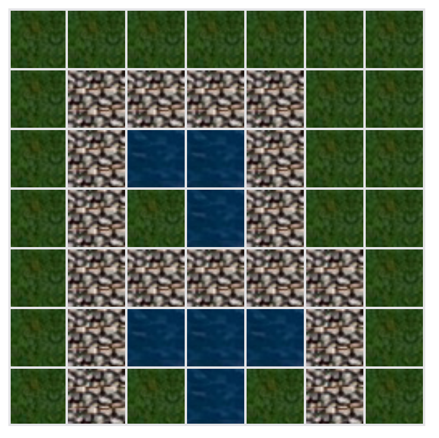

# Hot Springs Vacation

|                                                                                 |                      |
| ------------------------------------------------------------------------------- | -------------------- |
|  | Hot Springs Vacation |

---

[](https://choosealicense.com/licenses/mit/)
[](https://hot-springs.personal-projects.space/)
[](https://app.netlify.com/sites/hot-springs/deploys)

Access the deployed version of Hot Springs Vacation here:
<https://hot-springs.netlify.app/>

## Table of Contents

- [Description](#Description)
- [App Flow](#App-Flow)
- [Installation](#Installation)
- [Usage](#Usage)
- [Contributing](#Contributing)
- [Testing](#Testing)
- [Attribution](#Attribution)

## Description

`Hot Springs Vacation` is a Vue 2 web app that renders a grid with custom
dimensions (`width` and `height`). Set the `dig cells` and `rock cells` to
outline the starting locations of hot springs and rocks that water will have to
go around. With all the points laid out on the grid, press the `Let the water run` button, kick back, and start your next hot springs vacation!

| ->                                             | ->                                             | ->                                             |
| ---------------------------------------------- | ---------------------------------------------- | ---------------------------------------------- |
|  |  |  |

---

## App Flow

This is a Vue 2 app with Vuex and Vue-Router. TailwindCSS is used for styling

As the app begins in `src/main.js`, it loads `App.vue` as the first component
to load. It mainly takes care of the displaying routed content, and information
that should be displayed on all pages

A lot of the logic happens inside of the `Grid.vue` and `HotSprings.vue`
components. `HotSprings` takes user input (dimensions of the grid) and passes it
to the Vuex store

The `Grid` component renders the grid and allows to interact with it by clicking
on the cells directly. You can choose which points should be hot spring starting
points, and which points should be rocks. As long as there's at least one hot
spring starting point cell on the grid, you can click the `Let the water run`
button to let it loose and enjoy your vacation

Every `750ms` of your vacation here equals to one day, and there's a date
indicator to the right of the grid showing the exact day of your vacation
starting from today (your current browser time)

The hot springs spread as far as they can taking all the cells not protected by
the rocks cells. When changes are no longer being made on the grid, the water
stops and shows the result - the full date when the water from hot springs
finished spreading and your vacation ended

You can then reset the grid to delete all the rocks and water cells, or enter
new values in the input fields to define new dimensions of the grid

The main logic of the app is handled in the `Grid.vue` and `Vuex Store` files

The main function that takes care of spreading the water to adjacent cells is
located in `/src/utils/spreadWater.js`. Its job is to confirm the possibility of
spreading water in a specific direction passed in and spread the water or skip
the turn if it isn't possible.

## Installation

You need Node and Yarn to run this app; to handle Node and Yarn versioning
automatically, try [Volta](https://volta.sh/)!

This project has Node and Yarn versions pinned in the `package.json`. Volta will
automatically pull in the correct Node and Yarn versions for this package as you
run any Node or Yarn-related command

To install all the dependencies, run

```shell
yarn
```

## Usage

To open the development version of the app, run

```shell
yarn dev
```

For other commands that are available, refer to the `scripts` section of the
`package.json` file

## Testing

This application has Vue Jest tests set up with Vue-cli

To run the test suite, run

```shell
yarn test
```

## Attribution

- Hot spring icon made by [smalllikeart](https://flaticon.com/authors/smalllikeart) from [flaticon.com](https://flaticon.com/)
- Icons for cells made from the official gameplay screenshot of [`Heroes® of Might & Magic® III - HD Edition`](https://store.steampowered.com/app/297000/Heroes_of_Might__Magic_III__HD_Edition/) by Maksim Verkhoturov
  [](https://cdn.cloudflare.steamstatic.com/steam/apps/297000/ss_548367faf1cfa549c88585cb9b01f13b05b05ab7.1920x1080.jpg)
